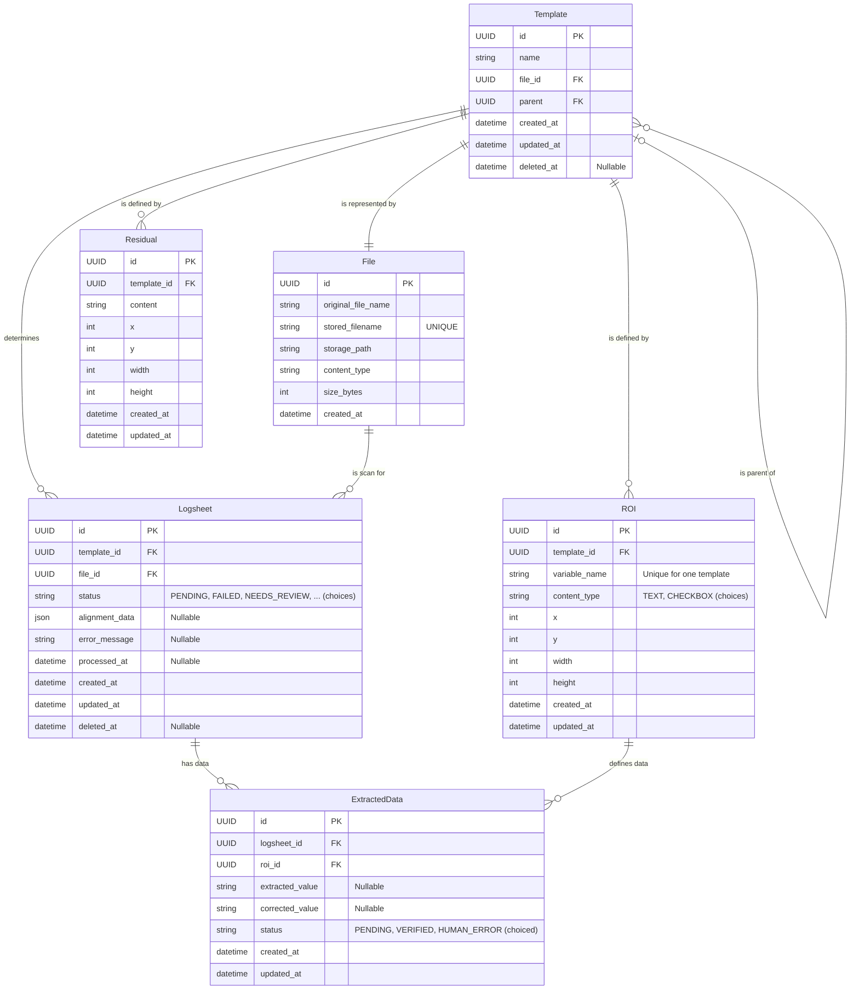

```mermaid
erDiagram
    Template {
        UUID id PK
        string name
        UUID file_id FK
        UUID parent FK
        datetime created_at
        datetime updated_at
        datetime deleted_at "Nullable"
    }

    File {
        UUID id PK
        string original_file_name
        string stored_filename "UNIQUE"
        string storage_path
        string content_type
        int size_bytes
        datetime created_at
    }

    ROI {
        UUID id PK
        UUID template_id FK
        string variable_name "Unique for one template"
        string content_type "TEXT, CHECKBOX (choices)"
        int x
        int y
        int width
        int height
        datetime created_at
        datetime updated_at
    }

    Residual {
        UUID id PK
        UUID template_id FK
        string content
        int x
        int y
        int width
        int height
        datetime created_at
        datetime updated_at
    }

    Logsheet {
        UUID id PK
        UUID template_id FK
        UUID file_id FK
        string status "PENDING, FAILED, NEEDS_REVIEW, ... (choices)"
        json alignment_data "Nullable"
        string error_message "Nullable"

        datetime processed_at "Nullable"
        datetime created_at
        datetime updated_at
        datetime deleted_at "Nullable"
    }

    ExtractedData {
        UUID id PK
        UUID logsheet_id FK
        UUID roi_id FK
        string extracted_value "Nullable"
        string corrected_value "Nullable"
        string status "PENDING, VERIFIED, HUMAN_ERROR (choiced)"
        datetime created_at
        datetime updated_at
    }

    Template ||--o{ ROI : "is defined by"
    Template ||--o{ Residual : "is defined by"
    Template ||--o{ Logsheet : "determines"
    Template |o--o{ Template : "is parent of"
    Template ||--|| File : "is represented by"

    File ||--o{ Logsheet : "is scan for"

    Logsheet ||--o{ ExtractedData : "has data"
    ROI ||--o{ ExtractedData : "defines data"
```
